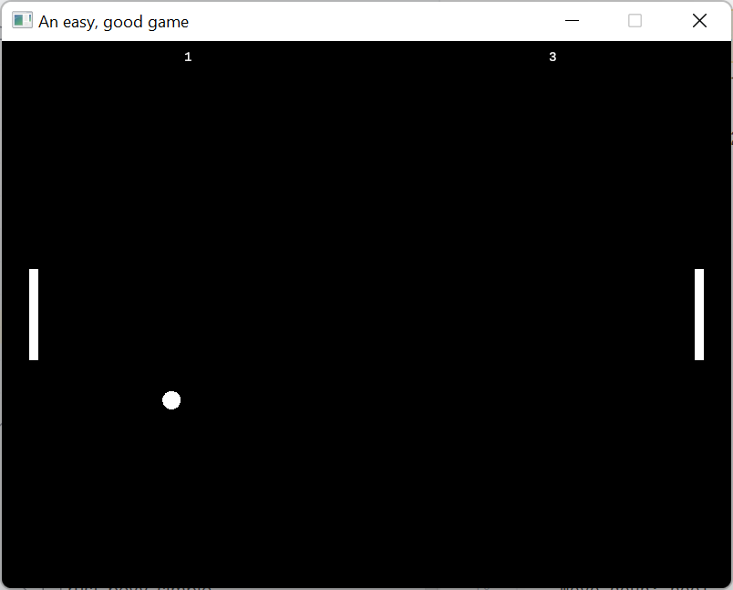

<!--
Copyright (c) 2026 Omnira CJSC
Author: Tunjay Akbarli
Date: August 6, 2026

Functionality: Pong example
-->

# Pong example

A simple example to show how to use Codira.

### How to run?

1. On the CLI, navigate to the `examples/rust-pong/codira` directory.
2. Run the compiler daemon from the CLI: `/path/to/codira build --watch`
3. Open another CLI and navigate to the `examples/rust-pong`.
4. Run the application from the CLI: `cargo run -p pong`

