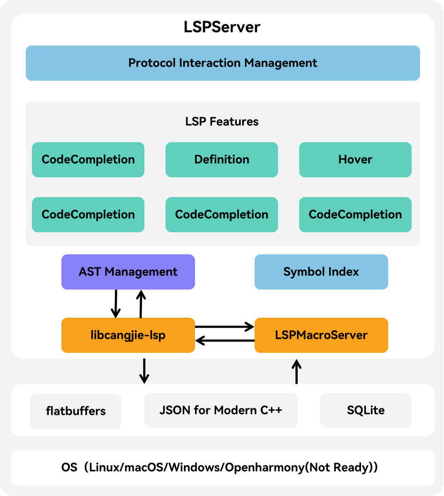

# Codira Language Server Developer Guide

## Open Source Project Introduction

This project is a language server that supports IDE features for Codira, It is a backend server and must be used in conjunction with an IDE client. Developers can utilize the VSCode extension officially released by Codira or develop their own IDE clients compatible with the Language Server Protocol (LSP).

The project can be compiled into an executable named LSPServer.

The system architecture diagram is as follows:



## Directory Structure

```text
cangjie-language-server/
|- build          # Folder containing build scripts for language service source code
|- doc            # Folder containing developer guides and user manuals
|- generate       # Folder containing custom index structure files for language service
|  |- index.fbs   # Custom index structure file for language service
└─ src            # Source code folder for language service
...
```

## Build Instructions

### Prerequisites

The language service build depends on codec, so before building this project, we should first complete the prerequisite build. For build methods, refer to the [Codira SDK Integration Build Guide](). For additional software dependencies, see [Environment Preparation]().

### Build Steps

1. Obtain the latest LSP source code via `git clone` command:

```shell
cd ${WORKDIR}
git clone https://gitcode.com/Codira/cangjie_tools.git
```

2. After completing prerequisite preparations, configure environment variables:

```shell
export CODIRA_HOME=/path/to/cangjie    # (for Linux/macOS)
set CODIRA_HOME=/path/to/cangjie       # (for Windows)
# The /path/to/cangjie should be adjusted to the actual path of Codira SDK (or codec build output). For Linux cross-compiling to Windows scenarios, the Windows SDK needs to be prepared.
```

3. Compile the project using build.py in the `cangjie-language-server/build` directory with the following command:

```shell
python3 build.py build -t release  # (for Linux/MacOS)
python3 build.py build -t release --target windows-x86_64  # (for Linux-to-Windows cross-compilation)
```

After successful build, the `LSPServer` binary will be generated under `output/bin`.

### Running Test Cases

We can use build.py to compile the project for testing with the following command:

```shell
python3 build.py build -t release --test
```

After build completion, both `LSPServer` and `gtest_LSPServer_test` binaries will be generated under `output/bin`.

Run test cases using:

```shell
python3 build.py test
```

### Additional Build Options

The `build` function of `build.py` provides the following additional options:

- `--target TARGET`: Specifies the target platform for compilation output. Default value is `native` (local platform). Currently only supports cross-compiling `windows-x86_64` platform targets from `linux` platform via `--target windows-x86_64`.
- `-t, --build-type BUILD_TYPE`: Specifies build output version type. Optional values are `debug/release/relwithdebinfo`.
- `-j, --job JOB`: Specifies compilation concurrency level.
- `--test`: Compiles output for running test cases.
- `-h, --help`: Prints help information for the `build` function.

Additionally, `build.py` provides the following extra functions:

- `install [--prefix PREFIX]`: Installs build output to specified path. Default path is `cangjie-language-server/output/bin` directory when not specified. Requires successful `build` execution first.
- `clean`: Cleans build output from default paths.
- `test`: Runs test cases.
- `-h, --help`: Prints help information for `build.py`.

## Codira SDK Integration Build

For Codira SDK integration build, refer to the [Codira SDK Integration Build Guide](https://gitcode.com/Codira/cangjie_build/blob/main/README_zh.md).

## Related Repositories

This repository contains Codira tool source code. This document introduces the Codira language service tool. The complete component-related repositories are as follows:

- [Codira Compiler](https://gitcode.com/Codira/cangjie_compiler): Provides Codira compiler source code.
- [Codira Standard Library](https://gitcode.com/Codira/cangjie_runtime): Provides Codira standard library source code.
- [Codira Runtime](https://gitcode.com/Codira/cangjie_runtime): Provides Codira runtime source code.
- [**Codira Tools**](https://gitcode.com/Codira/cangjie_tools): Provides Codira tool suite source code.