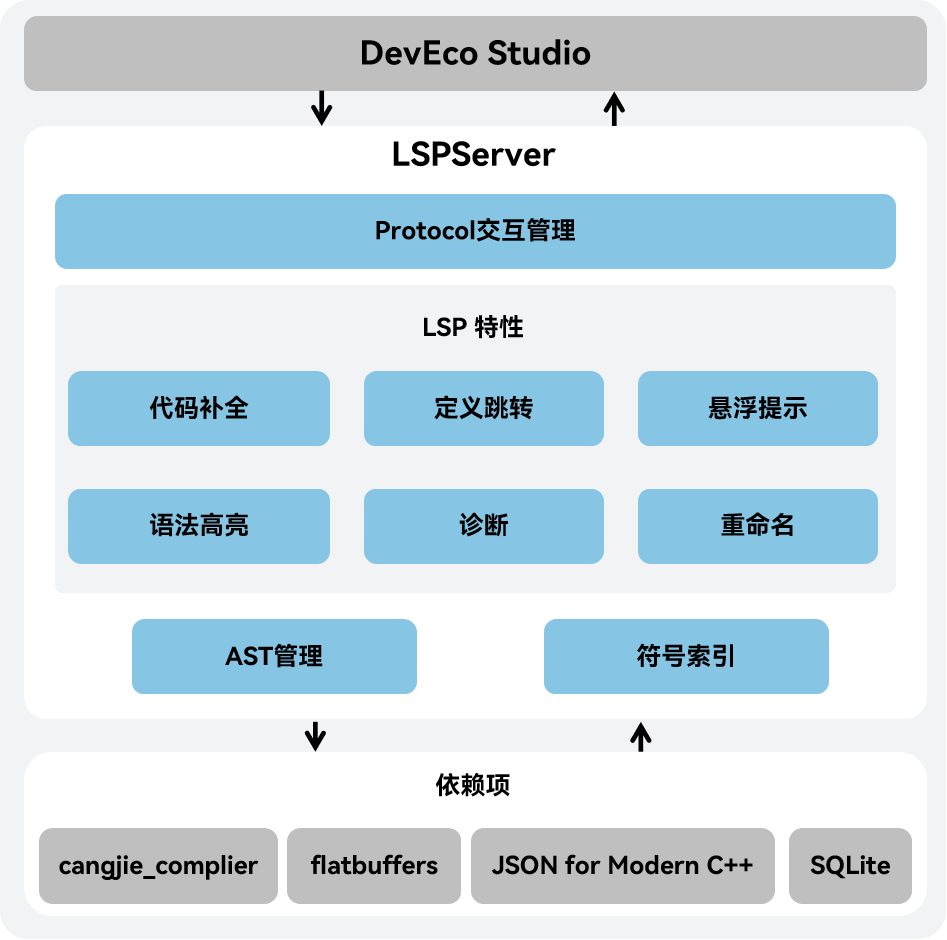

# 仓颉语言服务工具开发者指南

## 系统架构

该项目是一个语言服务工具，是在DevEco Studio上提供仓颉语言服务的服务器后端，需要搭配DevEco Studio客户端使用。

这个工程可以编译成一个名为LSPServer的可执行文件。

系统架构图如下：



如架构图所示：

Protocol交互管理：使用LSP协议实现与DevEco Studio客户端的通信，包括消息封装、消息转发、消息处理

LSP特性：实现了代码补全，定义跳转，语法高亮等语言服务功能
- 代码补全：在开发者编写代码时，根据输入的代码内容提供实时仓颉代码联想和补全能力
- 定义跳转：根据开发者指定的仓颉代码符号跳转到代码定义的位置，代码符号可以是类名、函数名、变量名等
- 悬浮提示：在开发者鼠标悬停时显示代码的详细信息，比如代码的定义类型，相关的注释等
- 语法高亮：根据仓颉语言的变量类型提供服务端语法高亮，可以对类名，函数名，变量名等显示不同颜色
- 代码诊断：当出现不符合仓颉语法或语义规则的代码时，会在相关代码段中给出错误或告警信息
- 重命名：提供代码的重命名功能，可以自动修改代码的定义和使用处的内容

AST管理：实现抽象语法树（AST）的构建和管理

符号索引：实现符号索引的生成和修改，提供搜索索引的功能

## 目录结构
   


```text
cangjie-language-server/
|-- build          # 语言服务源码构建脚本存放文件夹
|-- doc            # 语言服务开发指南和用户指南存放文件夹
    |-- figures    # 语言服务文档图片存放文件夹
|-- generate       # 语言服务自定义索引结构文件存放文件夹
    |-- index.fbs  # 语言服务自定义索引结构文件
|--src             # 语言服务源码文件夹
    |-- json-rpc            # 语言服务解析处理 LSP 协议的文件夹
    |-- languageserver      # 语言服务实现整体功能的文件夹
        |-- capabilities    # 语言服务实现 LSP 特性的文件夹
        |-- common          # 语言服务实现基础功能的文件夹
        |-- index           # 语言服务实现索引功能的文件夹
        |-- logger          # 语言服务实现日志功能的文件夹
    |-- launcher            # 语言服务启动和初始化的文件夹
```

## 编译构建

### 构建准备

语言服务构建依赖codec，所以在构建这个工程之前，我们应该先完成前置构建，构建方式参见[仓颉SDK集成构建指导书](https://gitcode.com/Codira/cangjie_build/blob/dev/README_zh.md)。更多软件依赖，参见[环境准备](https://gitcode.com/Codira/cangjie_build/blob/dev/docs/env_zh.md)。

### 构建步骤

1. 通过`git clone`命令获取`lsp`的最新源码：

```shell
cd ${WORKDIR}
git clone https://gitcode.com/Codira/cangjie_tools.git
```

2. 完成前置构建准备后，配置环境变量：

```shell
export CODIRA_HOME=/path/to/cangjie    # (for Linux/macOS)
set CODIRA_HOME=/path/to/cangjie       # (for Windows)
# /path/to/cangjie路径为仓颉SDK（或前置依赖codec构建产物）路径，根据实际情况作调整。Linux交叉编译Windows场景，需要准备Windows的SDK
```

3. 通过`cangjie-language-server/build`目录下的build.py来编译项目，命令如下:

```shell
python3 build.py build -t release  # (for Linux/MacOS)
python3 build.py build -t release --target windows-x86_64  # (for Linux-to-Windows)
```

构建完成后，将在`output/bin`下生成`LSPServer`二进制。

### 运行测试用例

我们可以使用build.py来编译用于测试的项目，命令如下:

```shell
python3 build.py build -t release --test
```

构建完成后，将在`output/bin`下生成`LSPServer`和`gtest_LSPServer_test`二进制。

使用以下命令运行测试用例：

```shell
python3 build.py test
```

### 更多构建选项

`build.py`的`build`功能提供如下额外选项：

- `--target TARGET`：指定编译目标产物的运行平台，默认值为`native`，即本地平台，当前仅支持`linux`平台上通过`--target windows-x86_64`交叉编译`windows-x86_64`平台的产物；
- `-t, --build-type BUILD_TYPE`：指定构建产物版本，可选值为`debug/release/relwithdebinfo`；
- `-j, --job JOB`：指定编译时的并发度；
- `--test`：编译运行测试用例的产物；
- `-h, --help`：打印`build`功能的帮助信息。

此外，`build.py`还提供如下额外功能：

- `install [--prefix PREFIX]`：将构建产物安装到指定路径，不指定路径时默认为`cangjie-language-server/output/bin`目录，`install` 前需要先正确执行 `build`；
- `clean`：清除默认路径的构建产物；
- `test`：运行测试用例；
- `-h, --help`：打印`build.py`的帮助信息。

## 仓颉 SDK 集成构建

仓颉SDK集成构建，参见[仓颉SDK集成构建指导书](https://gitcode.com/Codira/cangjie_build/blob/dev/README_zh.md)。
